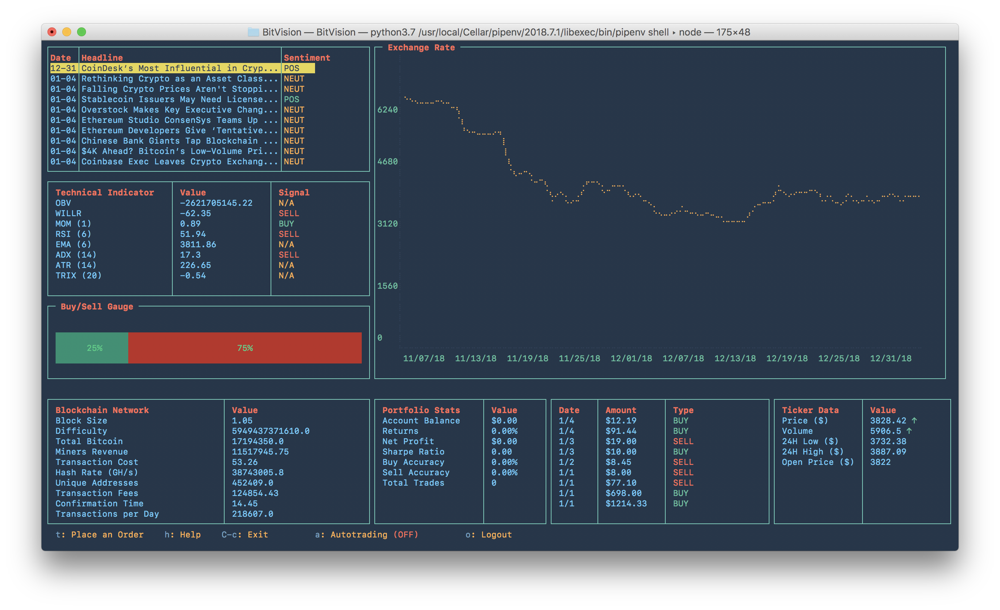
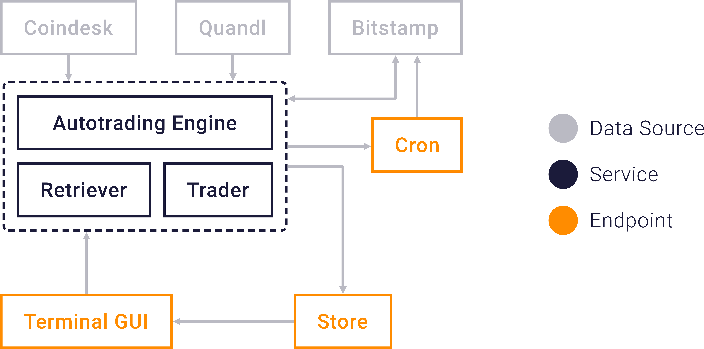

<h1 align="center">
  
  <br />
</h1>

[](https://www.npmjs.com/package/bitvision)
[](https://www.codacy.com/app/alichtman/BitVision?utm_source=github.com&utm_medium=referral&utm_content=shobrook/BitVision&utm_campaign=Badge_Grade)


`BitVision` is a real-time charting and trading dashboard for Bitstamp that works entirely in the terminal. It comes with an automated trading bot that uses machine learning to forecast price movements and place risk-adjusted daily trades.

Unlike other systems, there's no need to host a server or <!--spin up a Docker container-->edit tedious setup files. After installing, simply run `$ bitvision` to start using the dashboard.

<p align="center"></p>

BitVision's key features are:

- A daily exchange rate graph
- Real-time monitoring of Bitcoin-related news, technical indicators, and blockchain network data
- Logging of previous transactions and your current account balance
- Portfolio metrics, including your Sharpe Ratio, buy and sell accuracy, net profit, and returns _[UNDER CONSTRUCTION]_
- Easy toggling of automated trading and the ability to manually place orders

**Disclaimer:** BitVision is still in alpha. Some of the trading features are buggy and not fully tested; see all known bugs [here.](http://github.com/shobrook/BitVision/issues) Use at your own risk!

## Installation

> Requires `Node v10+` and `Python 3.7`

Install with `npm`:

```bash
$ npm i bitvision -g
```

## Usage

Run `$ bitvision` to boot up the dashboard.

If you want to enable trading, follow these instructions to acquire a Bitstamp API key and secret:

1.  Login to your Bitstamp account
2.  Click on Security -> API Access
3.  Select the following permissions for your access key:
    - Account Balance
    - User Transactions
    - Open Orders
    - Buy Instant/Limit Order
    - Sell Instant/Limit Order
4.  Click on the Generate Key button and make sure to store your secret in a secure place
5.  Click Activate
6.  Go to your email and click on link sent by Bitstamp to activate the API key

Once activated, just press `L` in the dashboard and a modal will pop-up asking you for your customer ID, API key, and secret. **These will be stored locally on your machine, so be sure to keep them safe.**

<br />
<p align="center"></p>
<p align="center"><i>You can download the color profile used in this demo <a href="https://github.com/shobrook/BitVision/raw/master/resources/BitVision-terminal-profile.terminal">here.</a></i></p>

## How it Works

The command-line interface is built on the Blessed.js library. The trading and charting architecture is built on the SciPy stack. An overview of the BitVision setup is shown below:

<br />
<p align="center"></p>
<br />

The BitVision architecture revolves around the _Store_, which is a local directory of JSON files used to achieve persistence of the application state (Bitstamp credentials, autotrading status, etc.) and data to be displayed on the dashboard. When a user triggers an event, like placing an order or refreshing the charts, a child process is spawned to execute the appropriate service (a Python module), which then updates the store with new data or an error flag.

Services are organized into three modules: the retriever, trader, and automated trading engine. The _retriever_ fetches ticker data, portfolio data, and transaction history from Bitstamp, blockchain data (hash rate, difficulty, etc.) from Quandl, and Bitcoin-related headlines from Coindesk. The _trader_ wraps the Bitstamp REST API and serves to authenticate the user's credentials, place buy or sell orders, and toggle automated trading. Lastly, the _automated trading engine_ is a machine learning system that attempts to predict the sign of the next-day change in<!--next-day directional change of--> Bitcoin price and place trades accordingly.

### Automated Trading Engine

Behind the scenes is a Logistic Regression model that's trained on a feature set of historical candlestick data, technical indicators, and blockchain data. When the engine is toggled on, a daily cron job is scheduled that (re)trains the model, predicts a price change, and places a risk-adjusted buy or sell order, depending on the prediction.

#### Technical Indicators

Technical indicators were chosen as part of the feature set because they help reduce noise in candlestick data and may reveal price patterns for the model to learn, if any exist. These particular indicators were chosen to give insight into price momentum, volatility, trends, and whether the cryptocurrency is overbought or oversold:

- Rate of Change Ratio (ROCR)
- Average True Range (ATR)
- On-Balance Volume (OBV)
- Triple Exponential Moving Average (TRIX)
- Momentum (MOM)
- Average Directional Index (ADR)
- Williams %R (WILLR)
- Relative Strength Index (RSI)
- Moving Average Convergence Divergence (MACD)
- Exponential Moving Average (EMA)

Note that, in a perfectly efficient market, the future price of a publicly traded asset is not statistically dependent on past prices; the price follows a "random walk," and it's impossible to reliably leverage technical analysis to beat the market. Now, efficient market theory suggests that the U.S. stock market is at least a semi-efficient market, and so we still consider this feature set because many traders utilize technical analysis in their trading strategies and there may exist a relationship between signals from indicators and executed trades, regardless of whether the signals themselves are accurate.

#### Blockchain Charts

Unlike other publicly traded assets, all Bitcoin-related fundamental data is available online, in the form of currency statistics, block details, mining information, network activity, and wallet activity. The following Blockchain variables are considered:

| Feature                  | Description                                                                                     |
| ------------------------ | ----------------------------------------------------------------------------------------------- |
| Confirmation Time        | Median time for a transaction to be accepted into a mined block and added to the public ledger. |
| Block Size               | Average block size in MB.                                                                       |
| Average Transaction Cost | Total miner revenue divided by number of transactions.                                          |
| Difficulty               | How difficult it is to find a new block.                                                        |
| Transaction Value        | Total estimated value of transactions on the blockchain.                                        |
| Hash Rate                | Estimated number of giga-hashes per second the BTC network is performing.                       |
| Transactions per Block   | Average number of transactions per block.                                                       |
| Unique Addresses         | Total number of unique addresses used on the blockchain.                                        |
| Total BTC                | Total number of Bitcoins that have already been mined.                                          |
| Transaction Fees         | Total value of all transaction fees paid to miners.                                             |
| Transactions per Day     | Total number of unique Bitcoin transactions per day.                                            |

#### Preprocessing

A number of standard preprocessing steps are taken before training the model:

1. The Last Observation Carried Forward (LOCF) method is used to fill missing values in the training set
2. Lag variables (spanning back three days) are created for each feature
3. A power transform is applied to each feature to convert it into something which more closely resembles a normal distribution

Additionally, since the price of Bitcoin has generally increased over time, the training set is balanced (using the random undersampling method) to prevent the model from learning a bias for positive predictions.

And lastly, a grid search is performed to find optimal hyper-parameter values for the Logistic Regression, and found them to be:

- Penalization Norm: L1
- Tolerance: 0.001
- Regularization: 1000
- Max Iterations: 150

#### Evaluation

Three models were trained on 80% of the dataset and tested on 20% before deciding on the Logistic Regression. The results:

| Model                     | Accuracy | Precision (PPV) | Specificity (TNR) | Recall (TPR) |
| ------------------------- | -------- | --------------- | ----------------- | ------------ |
| Logistic Regression       | 56.7%    | 56%             | 51.2%             | 62.2%        |
| Gradient Boosting Machine | 53.8%    | 53.9%           | 54.5%             | 53.1%        |
| Random Forest Classifier  | 50.5%    | 50.5%           | 52.6%             | 48.3%        |

As can be seen, the Logistic Regression had the highest overall accuracy, and highest accuracy in predicting uptrends, but also the lowest accuracy in predicting downtrends.

## Contributing

<!--"The reason the stock market is hard to predict is because it is a prediction." – Andrew Critch, *Algorithmic Trader at Jane Street*-->

The trading engine is a proof of concept, not something you should trust to make money. Nevertheless, a number of interesting improvements could be made to the system:

1. The Kelly Criterion should be used to allocate a risk-adjusted portion of the user's capital to each trade.
2. An LSTM network should be used instead of a Logistic Regression model. Price prediction is fundamentally a sequence learning task, which LSTMs are designed for. LSTMs have what's called memory cells, which can store information that lies dozens of time-steps in the past. This is important because, in the market, cause and effect can be quite far apart.
3. The following should be investigated as potential features: Bitcoin core Github activity, text analysis of Bitcoin-related news, tweets, and Reddit activity, and predictions made by popular Bitcoin forecasting websites or influencers (sadly, it's possible a non-trivial number of people base their trades on these forecasts).
4. Backtesting! And rolling window cross-validation should be tried out, not just holdout.

Aside from the trading engine, there are several improvements that can be made to the BitVision architecture. One long-term goal is to rewrite all the services in Node.js instead of Python, to avoid all the complications that come with cross-language execution. But if you're looking for a smaller issue to help with, plenty can be found [here.](http://github.com/shobrook/BitVision/issues)
