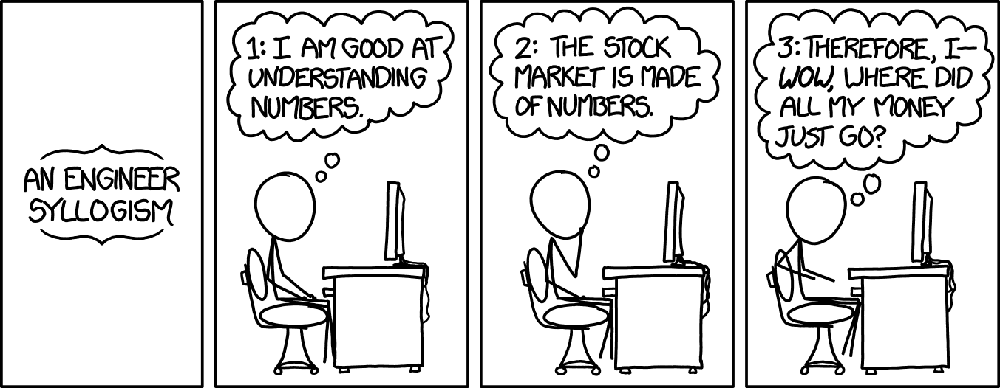

<h1 align="center">
  
  <br />
</h1>

[](https://www.npmjs.com/package/bitvision)
[](https://www.codacy.com/app/alichtman/BitVision?utm_source=github.com&utm_medium=referral&utm_content=shobrook/BitVision&utm_campaign=Badge_Grade)

[](http://scikit-learn.org/stable/)

`BitVision` is a real-time charting and trading dashboard for Bitstamp that works entirely in the terminal. It comes with an automated trading bot that uses machine learning to forecast price movements and place risk-adjusted daily trades.

Unlike other systems, there's no need to host a server or <!--spin up a Docker container-->edit tedious setup files. After installing, simply run `$ bitvision` to start using the dashboard.

<p align="center"></p>

Besides automated trading, BitVision's key features are:

- An exchange rate graph
- Real-time monitoring of Bitcoin-related news, technical indicators, and blockchain network data
- Logging of previous transactions and your current account balance
- Portfolio metrics, including your Sharpe Ratio, buy and sell accuracy, net profit, and returns [UNDER CONSTRUCTION]
- Easy toggling of automated trading and the ability to manually place orders

**Disclaimer:** BitVision is still in alpha. Some of the trading features are buggy and not fully tested; see all known bugs [here.](http://github.com/shobrook/BitVision/issues) Use at your own risk!

## Usage

> Requires `Node v10+` and `Python 3+`

Install `bitvision` with `npm`:

```bash
$ npm install bitvision
```

And run `$ bitvision` to boot up the dashboard.

If you want to enable trading, follow these instructions to acquire a Bitstamp API key and secret:

1.  Login to your Bitstamp account
2.  Click on Security -> API Access
3.  Select the following permissions for your access key:
    * Account Balance
    * User Transactions
    * Open Orders
    * Buy Limit Order
    * Sell Limit Order
4.  Click on the Generate Key button and make sure to store your secret in a secure place
5.  Click Activate
6.  Go to your email and click on link sent by Bitstamp to activate the API key

Once activated, just press `L` in the dashboard and a modal will pop-up asking you for your username, API key, and secret. **These will be stored locally on your machine, so make sure to keep them safe.**

<br />
<p align="center"></p>
<p align="center"><i>You can download the color profile used in this demo <a href="https://github.com/shobrook/BitVision/raw/master/resources/BitVision-terminal-profile.terminal">here.</a></i></p>

## How it Works

The command-line interface runs on the Blessed.js library. The trading and charting architecture runs on the SciPy stack. An overview of the BitVision architecture is shown below:

<br />
<p align="center"></p>
<br />

The BitVision architecture revolves around the *Store*, which is a local directory containing JSON files that hold information about the application state (Bitstamp credentials, autotrading status, etc.) and data to be displayed on the dashboard. When a user triggers an event, like making a trade or refreshing the charts, a child process is spawned to execute the appropriate service (a Python module), which then updates the store with new data or an error flag.

Services are organized into three modules: the retriever, trader, and automated trading engine. The retriever fetches ticker data from Bitstamp, blockchain network data (hash rate, difficulty, etc.) from Blockchain.info, and

(Insert diagram of the machine learning pipeline used in the autotrading engine.)

- Predicts the next-day directional change of Bitcoin price
- In the future, an LSTM is the preferred model
- Wanted features:

## An Obligatory Disclaimer

Please don't lose all of your money. A trading algorithm may outperform a random coin-toss in an experimental setting, but don't assume that it generalizes to the real world.

<!--According  to  market  efficiency  theory,US  stock  market  is  semi-strong  efficientmarket, which meansall public information is calculated into a stock's current share price,meaning that neither fundamental nor technical analysis can be used to achieve superiorgainsin a short-term (a day or aweek). The best description of this I've heard is by Julia Galef: "You can't predict the stock market because the stock market is a prediction."-->


