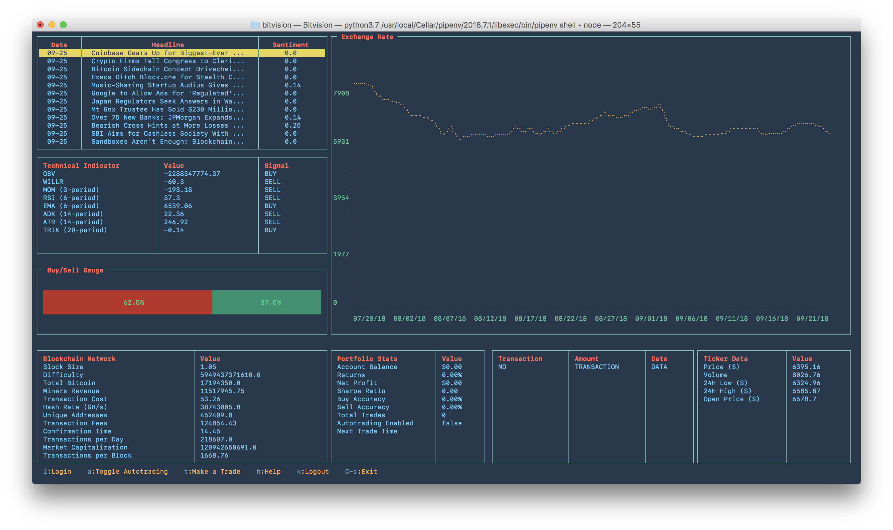

<h1 align="center">
  
  <br />
</h1>

[](https://www.npmjs.com/package/bitvision)

[](http://scikit-learn.org/stable/)

BitVision is a real-time charting and trading dashboard for Bitstamp that works entirely in the terminal. It comes with an automated trading bot that uses machine learning to forecast price movements and place risk-adjusted daily trades.

Unlike other systems, there's no need to host a server or spin up a Docker container. Simply install and run `$ bitvision` to start using the dashboard.

<p align="center"></p>

Besides automated trading, BitVision's key features are:

- An exchange rate graph
- Real-time monitoring of Bitcoin-related news, technical indicators, and blockchain network data
- Logging of previous transactions and your current account balance
- Portfolio metrics, including your Sharpe Ratio, buy and sell accuracy, net profit, and returns
- Easy toggling of automated trading and the ability to manually place orders

<!-- The trading algorithm was based on some research... -->

## Usage

> Requires `Node v10+` and `Python 3.x`

Install `BitVision` with npm:

```
$ npm install bitvision
```

Then run:

```
$ bitvision
```

And that's it! If you want to enable trading, first follow these instructions to acquire a Bitstamp API key and secret:

1.  Login to your Bitstamp account
2.  Click on Security -> API Access
3.  Select permissions for your access key
4.  Click on the Generate Key button and make sure to store your secret in a secure place
5.  Click Activate
6.  Go to your email and click on link sent by Bitstamp to activate the API key

Once activated, just press `L` in the dashboard and a modal will pop-up asking you for your username, API key, and secret. <!--These will be stored locally on your machine, so keep them safe.-->

#### Keybindings

| Keybinding | Action             |
| ---------- | ------------------ |
| A          | Autotrading Toggle |
| L          | Bitstamp Login     |
| O          | Logout             |
| T          | Trade BTC          |
| ESC        | Exit               |

## How it Works

Who ever said it works?

## Authors

The BitVision command-line interface was built by [@alichtman](http://github.com/alichtman), and runs on the `Blessed.js` library. The trading and charting architecture was built by [@shobrook](http://github.com/shobrook), and runs on the `SciPy` stack.

If you happen to make any money using BitVision, please consider donating a small portion of your earnings to our poor souls so we can continue making free software:

```
113VcufvK4UEvMNbSMRxJ7L418KL2U4wpb
```
