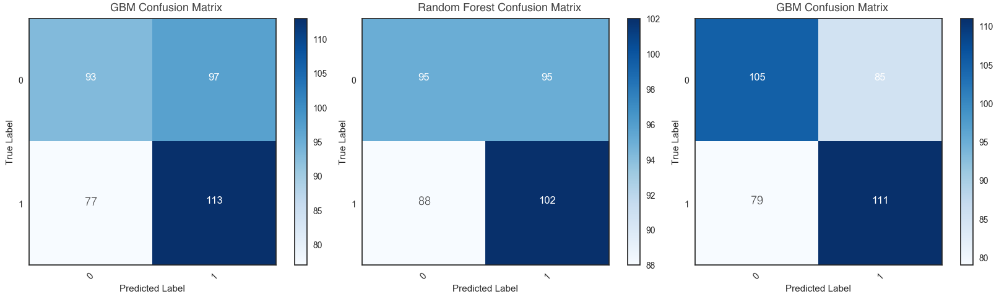

BitVision
===

<!--  -->

**Bitvision is a Bitcoin trading interface coupled with an automated trading algorithm that anyone can use.**
**Remember to give us a star, and we'll give you a free copy of the software!**

#### Installation and Usage

1. `$ npm install bitvision`
2. `$ ./install.sh`
3. `$ bitvision`

# TODO: Explain credential entry (either in CLI or editing the `.bitvision` file)

**Create a New Bitstamp API Key**

1. Login to your Bitstamp account
2. Click on `Security` -> `API Access`
3. Select permissions for your access key.
4. Click on the `Generate Key` button and make sure to store your `secret` in a secure place.
5. Click `Activate`.
6. Go to your email and click on link sent by Bitstamp to activate the API key.

**CLI Keybindings**

# TODO?

#### How does it work?

The system relies on a novel approach for predicting daily Bitcoin price movements using machine learning. Unlike other approaches, the feature set combines technical indicators, network data (hash rate, miner’s revenue, etc.), and sentiment ratings of Bitcoin-related news headlines.

Three supervised learning algorithms are implemented: a gradient boosting machine (GBM), random forest classifier, and long short-term memory network (LSTM). Experimental results suggest a **classification accuracy exceeding 60%** for the direction of next-day price change, with the LSTM consistently outperforming other models.

## What features does it use?

Historical OHLCV data is collected from Bitstamp, transactional data from Blockchain.info, and news headlines from Coindesk, starting from 2013, to derive the following features.

**Blockchain-Related Data**

Unlike many other publicly traded assets, all Bitcoin-related fundamental data is available online, which provides an opportunity explore the predictive potential of network attributes.

| Feature                  | Description                                                                                     |
| ------------------------ | ----------------------------------------------------------------------------------------------- |
| Confirmation Time        | Median time for a transaction to be accepted into a mined block and added to the public ledger. |
| Block Size               | Average block size in MB.                                                                       |
| Average Transaction Cost | Total miner revenue divided by number of transactions.                                          |
| Difficulty               | How difficult it is to find a new block, measured in...                                         |
| Transaction Value        | Total estimated value of transactions on the blockchain.                                        |
| Hash Rate                | Estimated number of giga-hashes per second the BTC network is performing.                       |
| Transactions per Block   | Average number of transactions per block.                                                       |
| Unique Addresses         | Total number of unique addresses used on the blockchain.                                        |
| Total BTC                | Total number of Bitcoins that have already been mined.                                          |
| Transaction Fees         | Total value of all transaction fees paid to miners.                                             |
| Transactions per Day     | Total number of unique Bitcoin transactions per day.                                            |

**Technical Indicators**

Technical indicators help reduce noise in price data and may improve an algorithm's ability to learn any existing price patterns. These particular indicators were selected to provide insight into price momentum, volatility, potential trends, and potential buy/sell signals.

# TODO: Replace formulas with explanations.

| Feature                               | Description                                                                                                   |
| ------------------------------------- | --------------------------------------------------------------------------------------------------------------|
| Rate of Change Ratio                  | $\frac{Close(t)}{Close(t - n)} \cdot 100$                                                                     |
| Momentum                              | $Close(t) - Close(t - n)$                                                                                     |
| Average Directional Index             | $\frac{\Sigma\frac{DI - (-DI)}{DI + (-DI)}}{n}$                                                               |
| Williams %R                           | $\frac{High - Close}{High - Low} \cdot 100$                                                                   |
| Relative Strength Index               | $\frac{Avg(PriceUp)}{Avg(PriceUp) + Avg(PriceDown)} \cdot 100$                                                |
| Moving Average Convergence Divergence | $(EMA_1(t) - EMA_2(t)) - EMA_osc(t)$                                                                          |
| Average True Range                    | $ATR(t) = ((n - 1) \cdot ATR(t - 1) + max(Abs(High - Low), Abs(High - Close(t - 1)), Abs(Low - Close(t - 1)))$|
| On-Balance Volume                     | $OBV(t) = OBV(t - 1) \pm Volume(t)$                                                                           |
| Triple Exponential Moving Average     | $(EMA(EMA(EMA(Close(t)))))/(EMA(EMA(EMA(Close(t - 1)))))$                                                     |

According to the Random Walk Hypothesis, which states that the future price of a publicly traded asset is not statistically dependent on past prices, it's impossible to reliably leverage technical analysis to beat the market. But this feature set is still considered because many traders utilize technical analysis in their trading strategies, and there may exist a relationship between buy/sell signals from technical indicators and executed trades, regardless of their actual effectiveness.

**Sentiment of Bitcoin-Related News Headlines**

The sentiment of historical news headlines was manually rated and averaged by a group of mechanical turks on a scale from -2 to 2 based on the content's perceived effect on public opinion, rather than its perceived effect on price. As multiple articles could be published in a day, each with potentially different sentiment ratings, a daily weighted average is calculated. The weights are derived from the number of tweets an article has, an indicator of the article's reach. And, to get an idea of accumulated sentiment, another feature is extracted by applying an integral transform to the weighted sentiment ratings.

## Target

The target variable is the direction (sign) of next-day price change, making this a binary classification task. Trying to forecast the actual price is usually a waste of time.

## Method

The following data cleaning and preprocessing techniques are applied to the feature set:

* The Last Observation Carried Forward (LOCF) method is used to fill missing values in the dataset
* Lag variables (spanning back three days) are created for each feature to provide information about trends
* A Box-Cox transform, which automatically evaluates a suite of power transforms and selects the best fit for a given feature, is applied in an attempt to reveal the underlying signal in each time series
* Lastly, features are scaled to more or less look like a Gaussian distribution with zero mean and unit variance

(Addition of dimensionality reduction and feature elimination algorithms coming soon)

As the price of Bitcoin is generally increasing over time, the training set is balanced (using the random undersampling method) to ensure that the algorithm doesn't learn a bias towards positive predictions, and so that the classification accuracy can be benchmarked against a random coin toss.

(Elaborate more on why each model was selected). The Gradient Boosting Machine and Random Forest Classifier were both selected due to their robustness to overfitting, and the LSTM to learn long-term trends. (Explain how hyperparameters were optimized for the first two models, and how the loss function was tweaked for the LSTM).

 

## Results

(Explain the different cross-validation methods that were used, then display a table showing the results).

 

#### Future Work

Some potential directions of this research:

* Understanding which features have the most predictive power by performing the Granger Causality test
* Exploring other feature engineering techniques
* Understanding interdependencies and relationships between features via exploratory data analysis
* Testing some potential features:
  * There may be a correlation between price change and predictions made by popular Bitcoin forecasting websites, since it's possible that a non-trivial number of traders use those predictions to inform trades
  * Bitcoin Core's Github activity could serve as another "fundamental" feature

#### Authors

- Jon Shobrook (`@shobrook`)
- Aaron Lichtman (`@alichtman`)

#### Donations

This is free, open-source software. If you'd like to support the development of future projects, or say thanks for this one, you can donate BTC at `113VcufvK4UEvMNbSMRxJ7L418KL2U4wpb`.
